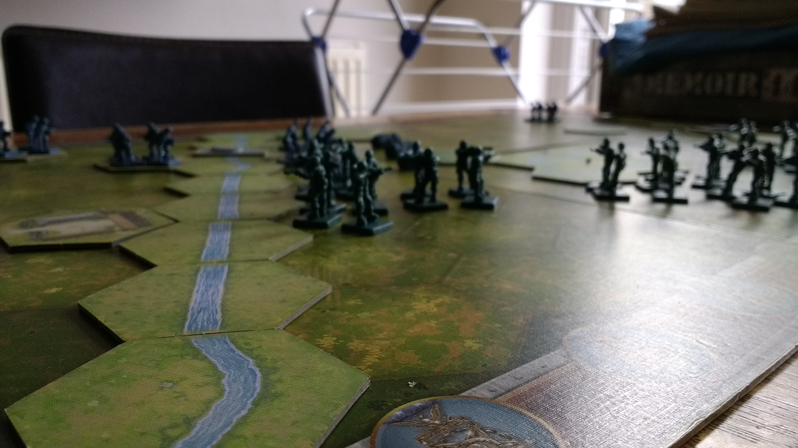
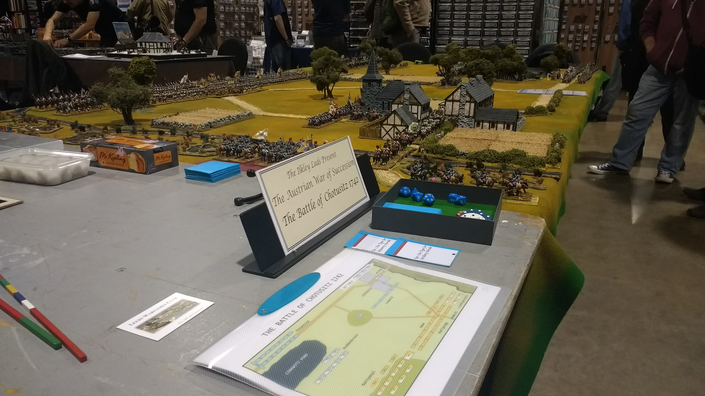
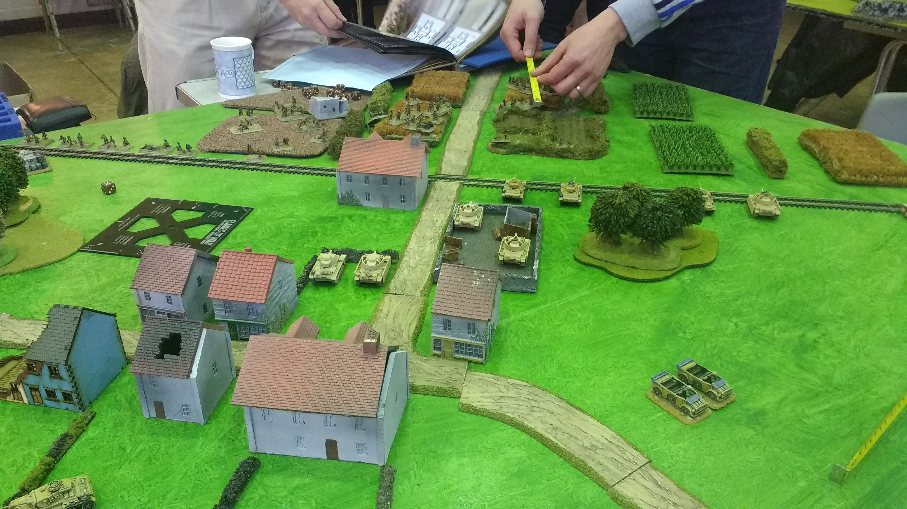
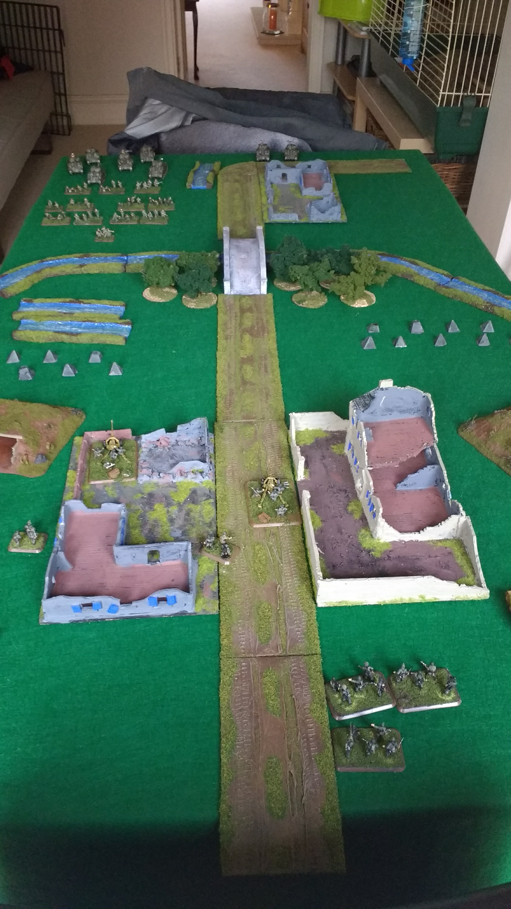

My names is Jack Hughes and I am relatively new to wargaming. My journey started in September 2016 with a game of Memoir '44. Just one game was enough to wet my appetite.

We are very lucky living in West Yorkshire to have three wargaming conventions close by. After my one game of Memoir '44, I headed to my local show which happily was happening soon after. I attended [FIASCO](https://leedswargamesclub.com/sig-int/f/fiasco-22) at the [Royal Armouries](https://royalarmouries.org/) in Leeds and discovered the world of participation tabletop wargames.

## A Sampling of Flames of War

Whilst at FIASCO for the first time I encountered the Leeds Night Owls wargaming club. Happily the club meet every Sunday morning within 30 minutes drive of my home. I eventually ventured forth one Sunday and attended the club. I was given a warm welcome and was introduced to the joys of tabletop wargaming. My first game proper was Flames of War version 3.

The image below is from a later game of Flames of War. It may well be the final time Flames of War version 3 was played at the club.

Not long after this game Flames of War kind of petered out. The new version 4 had only just been released and people kind of drifted away for a while.

I am not the most natural modeler or painter. So, off to ebay I went and picked up one of the old version 3 starter sets.

## The Bolt Action Years

Bolt Action is a huge World War 2 skirmish game in the UK and beyond. The game absolutely dominated the tables at Night Owls for many years.

Things started to get a bit samey. Week in week out playing the same armies in very similar scenarios. Slowly players just drifted away from it.

More recently, Bolt Action has started to bring new members into the club. You've got to be grateful for anything that brings in new members. New members bring new dynamism and enthusiasm.

Bolt Action certainly isn't my favourite game but it does give a good, social experience with some very fine looking tables.

## A Return to Flames

As soon as Flames of War version 4 started to release the D Day late war books things began to bloom at the club. I visited ebay again and purchased quite a lot of German figures. I like how Flames of War plays with the interplay between players rolling to hit and then your opponent rolling to save.

## The Search for More

One thing I'm determined to do is get better at painting. I know I'm never going to win any prizes but my ambition is just to paint to a tabletop standard and I think I'm already there. They say that you need to paint close to 1,000 figures to get a reasonable idea of what you are doing. I'm probably in the 400-500 zone so I am starting to get a reasonable idea. My advice is to seek advice from your local Warhammer store. I've received great advice from there. The employees at Warhammer usually have experience with historical miniatures so are well placed to give good advice.

I used COVID-19 induced home time to paint quite a lot of Russian infantry for Team Yankee in 15mm as well as two armies in 6mm for the same ruleset.

I have completed two battalion sized (at 3:1 scale) armies in 6mm for O Group in 2022.
