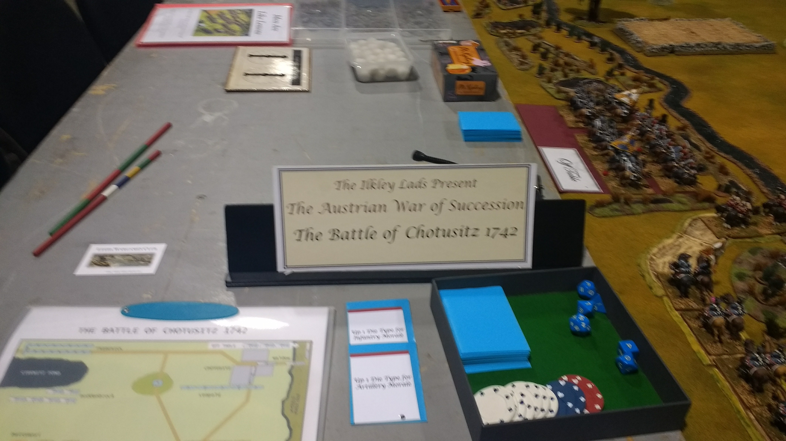
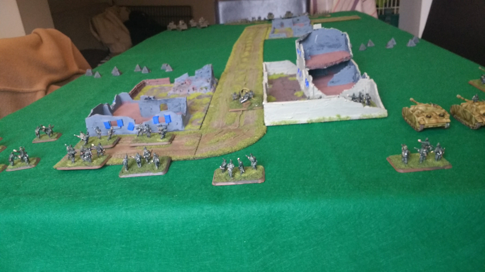
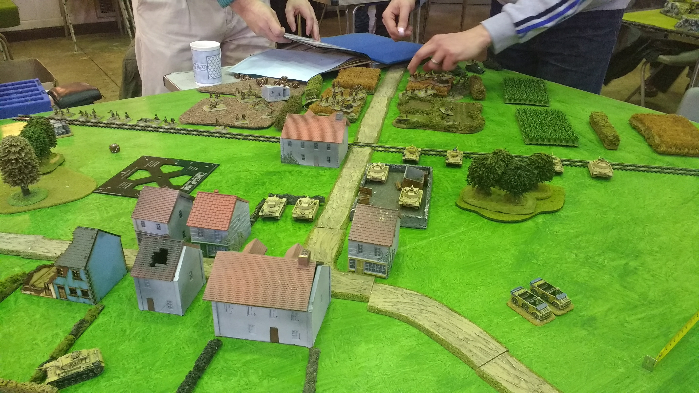
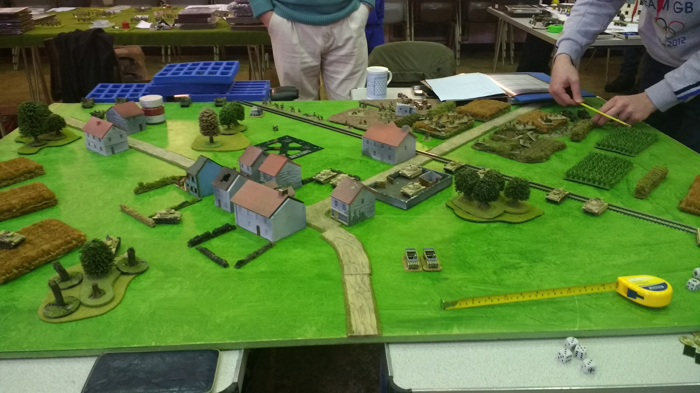

My names is Jack Hughes and I am relatively new to wargaming. My journey started in September 2016 with a game of Memoir '44. Just the one game was enough to wet my appetite.

We are very lucky living in West Yorkshire to have three wargaming conventions close by. After my game of Memoir '44 I headed to my local show which happily was happening soon after. I attended [FIASCO](https://leedswargamesclub.com/sig-int/f/fiasco-22) at the [Royal Armouries](https://royalarmouries.org/) in Leeds and discovered the world of participation tabletop wargames.

<<pictures from  go here>>

## A Sampling of Flames of War

## The Bolt Action Years

## A Return to Flames

## The Search for More

