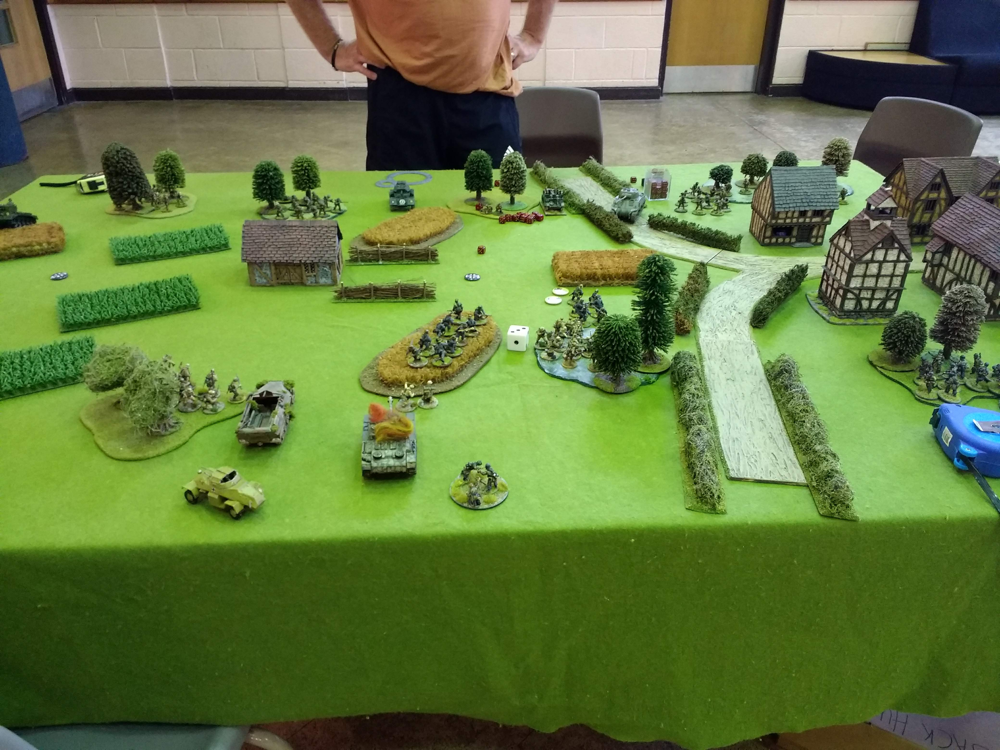
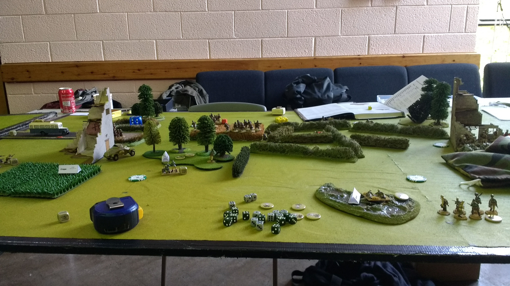
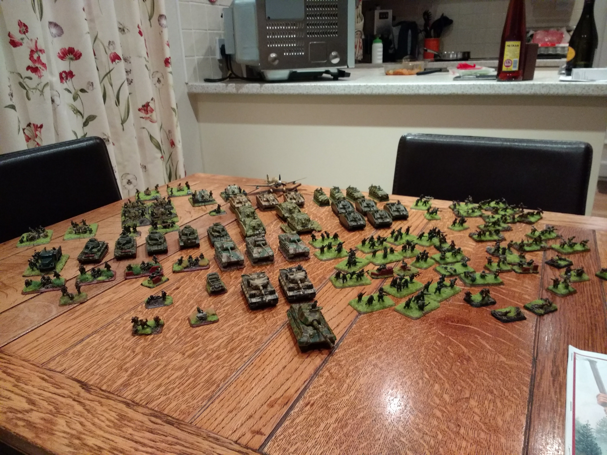
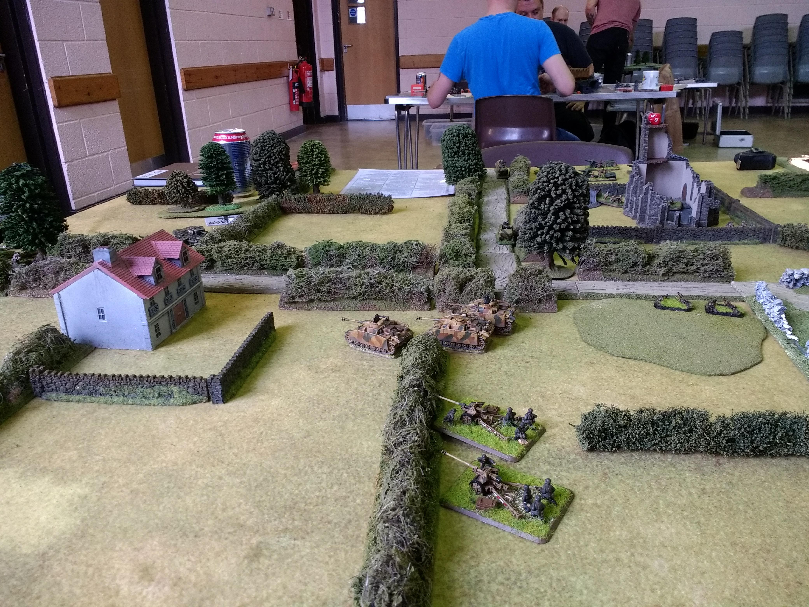

A quick survey of my World War 2 wargaming journey so far as of September 2022.

## Bolt Action

Bolt Action is the absolute jugernaut of hobbyist World War 2 wargaming. A lot of wargamers enter the hobby through Warhammer sci-fi offerings eventually want to go historical and the logical place for them to go is Bolt Action.

Bolt Action has quite a bustling tournament scene. I have taken part in three tournaments so far. I have garnered two wooden spoons. In my defence, I don't take the competitive side of the hobby particularly seriously. If you want to win tournaments, don't show up with a Last Levy list or play with an early war list in a late war tournament.

## Flames of War

Flames of War is probably my favourite World War 2 ruleset. I enjoy the theatre of it as well as the interactivity you have with your opponent. I started off by purchasing a ready painted version 3 starter set containing both British and Germans from eBay and a couple of years later purchased a job lot of Germans.

I have recently painted quite a lot of German mortars as well as 7.5cm light and 15cm heavy artillery to complete my Beach D Day German Company. Takes quite a bit of breaking down when fielded with the full allocation of artilery.

## 'O' Group

'O' Group is a battalion level game usable with figures of pretty well any scale you want. Whilst I do have two painted armies for 'O' Group, I haven't actually played a full game as yet. I am hoping to fix this oversight by the end of 2022. I have played in a demonstration game at the Recon wargaming show put on by Leeds Night Owls.

## The Future

One of the problems with the rules already mentioned is that they focus on quite small actions within a battle. What I want to do is to actually fight large, multi-day named battles. My initial focus when starting wargaming was to give some focus to learn more about the history of World War 2. I don't feel that platoon or company level games really provide the scoffolding to aid that learning. Partly this blog is my way to document the search for a set of rules that will allow me to fight full named battles.
