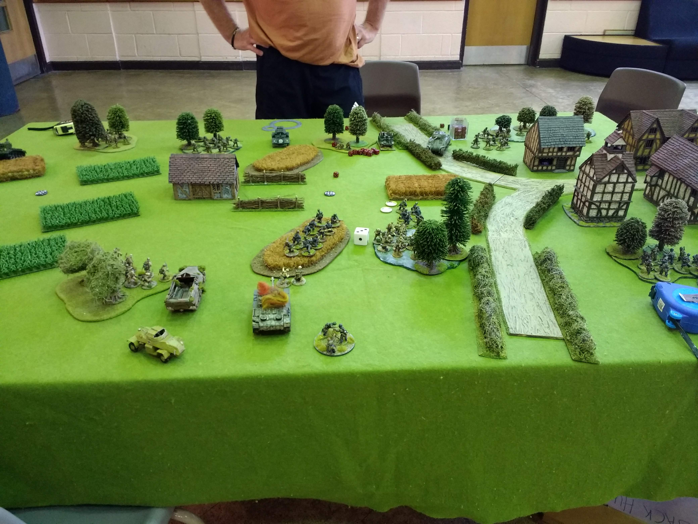
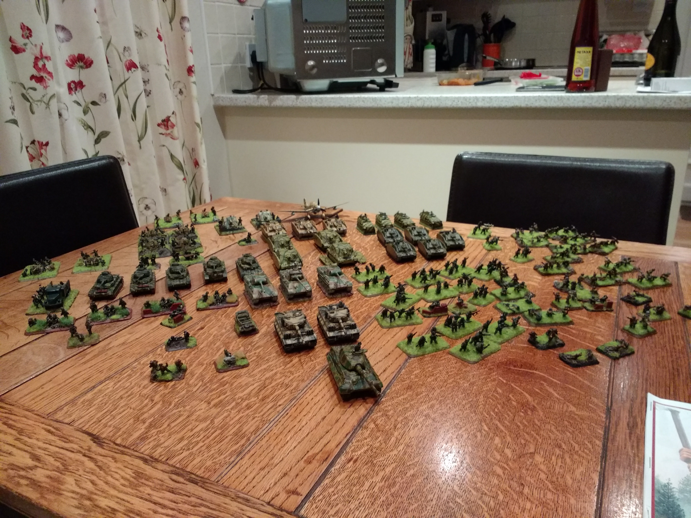
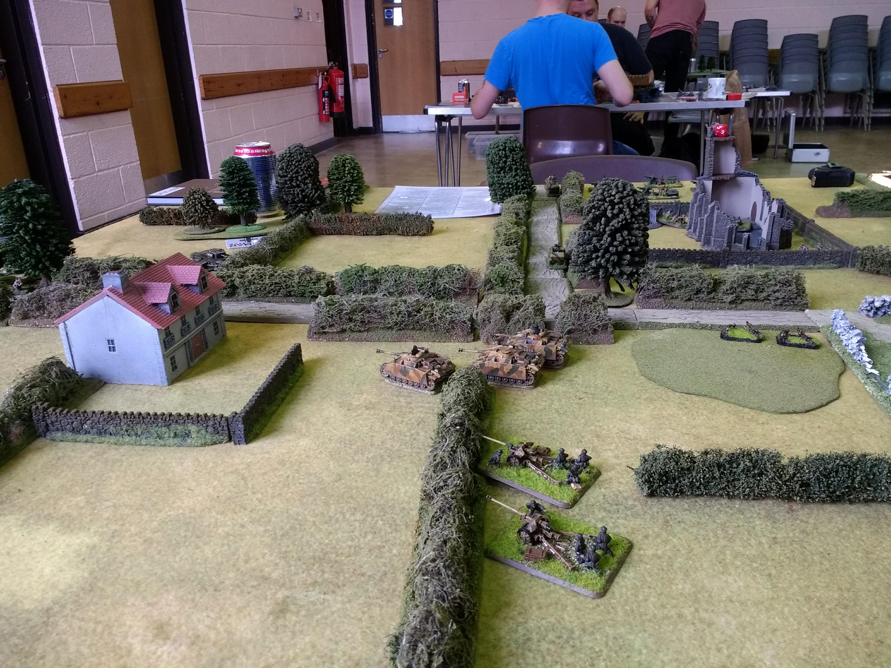

A quick survey of World War 2 wargaming.

## Bolt Action

Bolt Action is the absolute jugernaut of hobbyist World War 2 wargaming. A lot of wargamers enter the hobby through Warhammer sci-fi offerings eventually want to go historical and the logical place for them to go is Bolt Action.

## Flames of War

## 'O' Group
